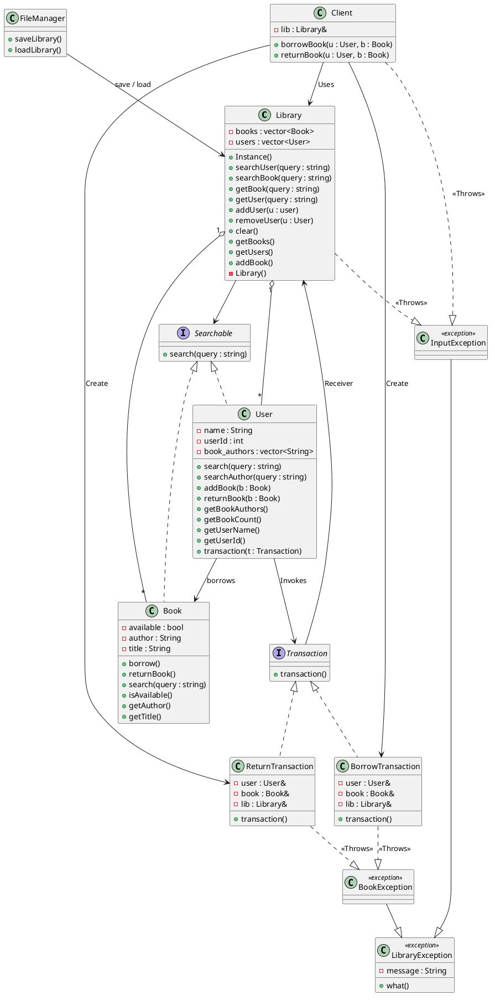

# Adaptive-Library-Management-System
Library Management System using OOP principles to efficiently manage and organize books, users, and transactions within a library setting. <br>

Use the shell scripts within the scripts folder to build and run unit tests. Googletest framework was used. ```./scripts/build.sh``` and ```./scripts/run.sh```




